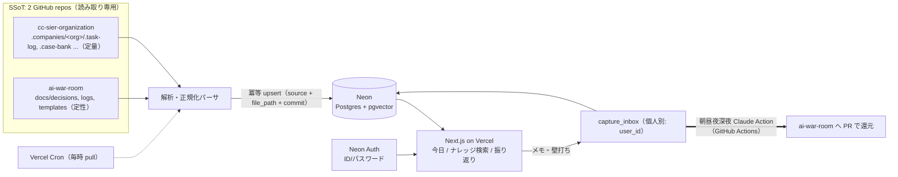

# decision-cockpit

> A personal/small-team decision cockpit that unifies organizational metrics and personal decision logs into one searchable, data-driven workspace.

組織運用メトリクス([SAS-Sasao/cc-sier-organization](https://github.com/SAS-Sasao/cc-sier-organization))と個人の判断ログ([SAS-Sasao/ai-war-room](https://github.com/SAS-Sasao/ai-war-room))の Markdown/JSON を統合し、データドリブンに意思決定するための個人/小規模チーム向けコックピット。過去の判断とその後の組織スコアを時間軸で結びつけ、「今、何に着手すべきか」「あの判断は正しかったか」を素早く確かめられるようにする。

> **現状: スキャフォールド段階。** リポジトリには開発基盤(Claude Code 用の rules/agents/skills/hooks)とアプリ骨格、要件定義([docs/design/requirements.md](docs/design/requirements.md))が入っている。下記の機能は MVP として計画しているもので、実装はロードマップの各マイルストーンで進める(未実装は「Roadmap」と明記)。

## クイックスタート(Docker)

開発は Docker(Docker Desktop)で行う。app + ローカル pgvector が立ち上がる。

```bash
git clone https://github.com/SAS-Sasao/decision-cockpit.git
cd decision-cockpit
cp .env.example .env        # 秘密値を設定(.env は gitignore 済み)
docker compose up --build   # 起動 → http://localhost:3000
```

```bash
docker compose up           # 2回目以降(ビルド不要なら)
docker compose down         # 停止(DB データは volume に残る)
docker compose down -v      # 停止 + DB データ破棄
```

> ローカルの `DATABASE_URL` は db コンテナを指す(compose が設定)。WSL から使う場合は Docker Desktop の **Settings → Resources → WSL Integration** で対象ディストロを有効化しておく。詳細は[セットアップ](#セットアップ)と [docs/setup/neon-vercel-setup.md](docs/setup/neon-vercel-setup.md)。

## 何ができるか(主な機能)

いずれも MVP スコープ。現在はビュー骨格のみで、データ連携は Roadmap で実装する。

1. **ナレッジ再利用** — 過去の `decision`(ai-war-room)をテーマ/キーワードで検索(pgvector 主軸)し、同一テーマ・近接期間の組織実績(完了件数・実スコア)を時間軸で紐づけて提示する。
2. **今日(着手判断)** — オープンな WBS / kanban を一覧し、各タスクにスコア・差し戻し履歴・関連 decision を添えて着手判断を支援する。
3. **振り返り** — 週次/月次で報酬スコア(4 シグナル)・LLM-as-Judge 3 軸・品質ゲート合格率のトレンドを可視化し、同期間の判断ログを並置する。
4. **キャプチャ + 壁打ち(個人別)** — UI から作業メモ・課題・次の一手を `capture_inbox`(個人別)に保存。壁打ちはサーバ側で Claude を呼び、pgvector で関連文脈を注入する。機微データ(profile/minefield 等)は文脈に含めない。
5. **自動整理(朝昼夜深夜)** — GitHub Actions + `claude-code-action` が未処理の `capture_inbox` を整理し、ai-war-room の `docs/logs` / `docs/decisions` へ **PR で還元**する(直接 push しない)。
6. **ユーザー管理・認証** — ID/パスワードのログイン。複数ユーザー対応の土台(`roles` / `user_roles`、`capture_inbox.user_id`)を当初から用意する。

## アーキテクチャ(データの流れ)



- **取り込みは pull 型**。Vercel Cron(毎時)が GitHub API 経由で 2 repo を読み(書き込みは一切しない)、解析・正規化して Neon に冪等 upsert する(キー = `source + file_path + commit`)。
- **横断の結合キーは「時間軸 + タグ/トピック」**。取込時に slug 化し、シノニム辞書で正準語へ寄せる。
- **生キャプチャと整理済み知識を分離**。UI が書くのは `capture_inbox` のみ。整理済み知識への還元は Claude Action の PR 経由でのみ行う。

### 開発環境(Docker)

開発は **Docker(Docker Desktop)** で行う。`docker compose` で次の2コンテナを起動する:

- **app** — Next.js(App Router)を dev モードで起動(ホットリロード)
- **db** — Postgres + **pgvector**(`pgvector/pgvector` イメージ)。**ローカル完結**で、初回起動時に `CREATE EXTENSION vector` を自動実行する

ローカル開発では `DATABASE_URL` がこの **db コンテナ**を指す。**Neon(クラウド)は staging / 本番、およびマイグレーションのブランチ検証に使う**(`.env` の `DATABASE_URL` を Neon に向ければそのまま Neon 開発にも切替可)。本番(Vercel)では従来どおり Neon に接続する。

```bash
docker compose up --build        # 初回(イメージビルド + DB 初期化)
# → http://localhost:3000 / DB は localhost:5432(コンテナ内は db:5432)
docker compose down              # 停止(DB データは volume に残る)
docker compose down -v           # DB データも破棄
```

定義ファイル: [`docker-compose.yml`](docker-compose.yml) / [`Dockerfile.dev`](Dockerfile.dev) / [`docker/initdb/01-pgvector.sql`](docker/initdb/01-pgvector.sql)。

## 技術スタック

| 領域 | 採用 |
|------|------|
| フロント/サーバ | Next.js (App Router, TypeScript) on Vercel |
| 開発環境 | Docker(`docker compose`): app + ローカル pgvector コンテナ |
| DB / 検索 | Neon (Postgres) + pgvector(本番) / ローカルは pgvector コンテナ |
| 認証 | Neon Auth (ID/パスワード)。認可は自前の `roles` / `user_roles` |
| 埋め込み | 多言語対応モデルを env で **1 モデルに固定**(日本語品質を優先・要検証) |
| 同期 | Vercel Cron + GitHub API (pull・読み取り専用) |
| 自動整理 | GitHub Actions + `claude-code-action` (朝昼夜深夜の 4 スロット) |

詳細は [docs/design/requirements.md](docs/design/requirements.md) を参照。

## データソースと同期(対象・対象外・プライバシー)

2 つのソースは **SSoT(信頼できる唯一の情報源)**。本アプリは原則「読む側」で、元 repo には**一切書き込まない**(読み取りは GitHub API 経由のみ)。整理済み知識の還元は Claude Action の PR でのみ行う。対象/対象外は各 repo の `.gitignore` を根拠とする(以下、確認日 2026-06-14)。

### [cc-sier-organization](https://github.com/SAS-Sasao/cc-sier-organization)(定量データ)

データは `.companies/<org>/` 配下(例: `domain-tech-collection`, `jutaku-dev-team`, `standardization-initiative`)。

**同期対象(Git 管理)** — `.gitignore` 上でコメントアウトされ「データドリブン意思決定アプリの素材として Git 管理対象化(2026-06-14)」と明記:
- `.companies/<org>/.task-log/`(YAML・報酬スコア 4 シグナル)
- `.companies/<org>/.case-bank/`(JSON・スコア推移 / LLM-as-Judge 3 軸)
- `.companies/<org>/.quality-gate-log/`(品質ゲート合否)
- `.companies/<org>/.session-summaries/`(セッション統計)
- `.companies/<org>/.conversation-log/`(Markdown・`[PHONE]` 等マスキング済み)
- `.companies/<org>/docs/`・`.companies/<org>/masters/`

**同期対象外** — `.gitignore` に記載:
- `.companies/.active`(ローカルの組織切替設定)
- `.companies/*/.interaction-log/`(Hooks 自動生成・Git 管理外)
- `.claude/agent-memory/`(ローカル学習データ)
- ビルド生成物: `node_modules/`, `dist/`, `bk/`, `generated-diagrams/`, `docs/.vitepress/{cache,dist}/`, `.claude/scheduled_tasks.lock`

### [ai-war-room](https://github.com/SAS-Sasao/ai-war-room)(定性データ)

**同期対象(Git 管理)**: `docs/decisions/`・`docs/logs/`・`docs/templates/`(必要に応じて `docs/knowledge/` 等も)。

**同期対象外** — `.gitignore` に記載の**機微ファイル**(取り込み・転記しない):
- `docs/profile.md`, `docs/minefield.md`, `docs/bugs.md`, `docs/mental-care.md`
- `.archive/`(個人情報を含む作業トレース)、`.mcp.json`(トークンを含む可能性)、`.claude/settings.local.json`, `CLAUDE.local.md`

### プライバシー方針

- 取り込むのは**マスキング済み**の会話ログのみ。`profile.md` / `minefield.md` 等の機微ファイルは取り込まず、壁打ちの文脈にも含めない。
- 生キャプチャ・壁打ちは**所有者(user_id)本人のみ参照可**(アプリ層でスコープを強制。将来 RLS 併用可)。
- 整理済み(SSoT → 索引)は共有知識として扱う。

## 開発の進め方(ループエンジニアリング)

「作業役」と「判定役」を分離し、機械判定で自走させるスタイル。

- **設計 → レビュー → 実装** の順を守る。実装(`/goal`)の前に対象トピックの設計が `docs/design/` にあり、design-review を**全レンズ PASS**していること。
- **設計**: `/basic-design <topic>`(基本設計) / `/detailed-design <topic>`(詳細設計)。設計は主セッション(human-in-loop)で執筆し、critic には書かせない。
- **設計レビュー**: `/design-review <topic>` が arch / data / sec の 3 critic(読み取り専用)に委譲し、全レンズ PASS で合格。
- **実装と検証**: 実装は executor サブエージェント(db / ingestion / search / backend / frontend / test)に委譲して要約で受け取る。受け入れ条件は `acceptance-judge` が独立検証する。
- **自走と監視**: `/goal` に機械判定可能な完了条件(達成状態・禁止事項・ターン上限・節目 commit)を書いて進め、`/loop` で監視する。
- **強制とガイダンスの分離**: 確実に守らせる制約は `.claude/settings.json` の permissions(deny-first)と PreToolUse hook(exit 2 で遮断)に置く。`CLAUDE.md` / `.claude/rules/*.md` はガイダンス専用で短く保つ。

主な SKILL: `scaffold-cockpit` / `add-migration` / `add-parser` / `verify-acceptance` / `sync-dry-run` / `basic-design` / `detailed-design` / `design-review`。

## セットアップ

> アプリ機能は開発中(スキャフォールド段階)。現時点で動かせるのは Next.js の骨格と `npm run build` まで。

### 必要なツール
- **Docker Desktop**(開発の標準。app + ローカル pgvector を起動)
- gh CLI(GitHub 操作用)
- Claude Code CLI(設計・実装ループ用)
- Neon プロジェクト / Vercel アカウント(staging・本番・デプロイ用)
- (Docker を使わない場合のみ)Node.js 18+ / npm

### 手順(Docker・推奨)
```bash
git clone https://github.com/SAS-Sasao/decision-cockpit.git
cd decision-cockpit
cp .env.example .env       # 秘密値を設定(下記。DATABASE_URL はローカル既定で db コンテナを使う)
docker compose up --build  # app + db(pgvector)を起動 → http://localhost:3000
```

### 手順(ローカル Node・Docker を使わない場合)
```bash
npm install
cp .env.example .env   # 値を設定(下記)。DATABASE_URL は別途用意した Postgres/Neon を指定
npm run build          # 骨格のビルド確認
npm run dev            # ローカル起動(http://localhost:3000)
```

### 環境変数
`.env.example` をコピーして `.env` に設定する(**実値は repo に直書きしない**。`.env` は gitignore 済み)。必要なキー(名称のみ):

- `DATABASE_URL` — Neon の接続文字列
- `EMBEDDING_MODEL` / `EMBEDDING_DIM` / `EMBEDDING_API_KEY` — 埋め込み(1 モデルに固定)
- `GITHUB_TOKEN` — SSoT 読み取り用(読み取り専用 PAT)
- `WARROOM_PAT` — ai-war-room への PR 書き戻し用(最小スコープ PAT)
- `NEON_API_KEY` — Neon 管理 / MCP(開発時)
- (Claude Action はサブスク認証。GitHub Secret `CLAUDE_CODE_OAUTH_TOKEN` を使用 — ローカル `.env` には不要)

## ロードマップ

| マイルストーン | 内容 | 状態 |
|----------------|------|------|
| **M0** | 認証・ユーザー管理土台(Neon Auth + ログイン画面 + `roles`/`user_roles` + `capture_inbox.user_id`) | 計画 |
| **M1** | 取り込み基盤 + 振り返り(実スコア) | 計画 |
| **M2** | ナレッジ再利用(pgvector 検索) | 計画 |
| **M3** | 今日(着手判断)ビュー | 計画 |
| **M4** | キャプチャ + 壁打ち(個人別) | 計画 |
| **M5** | 整理 Actions ×4(朝昼夜深夜) | 計画(ワークフロー雛形あり・既定で無効) |
| (将来) M6 | 完全分離モデル / 領域ヘルス検知 / 本格 RBAC | 将来拡張 |

> 認証は他機能の前提になるため M0 に前出し。詳細は [docs/design/requirements.md](docs/design/requirements.md) の §9。

## ライセンス

個人/小規模チーム向けプロジェクト。LICENSE は未設定(必要に応じて追加予定)。**元リポジトリ(cc-sier-organization / ai-war-room)のデータには本リポジトリのライセンスは及ばない**点に注意。
